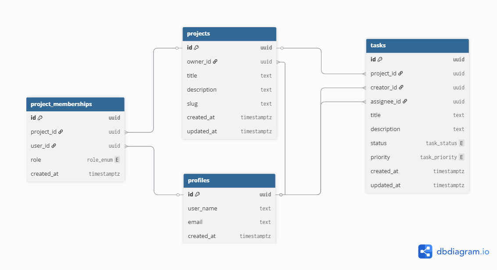

# Data Model

The data model is structured to support collaborative project management with role-based access.

## Overview

## Entities

- Profiles
- Projects
- ProjectMemberships
- Tasks

## Relationships

- A project can have multiple tasks
- A project can have multiple users
- Users are linked via memberships
- User can have multiple tasks
- Memberships are unique and belong to exactly on user and one project

## Design Decisions

- Tasks persist even if users are deleted
- Assignee is set to null on deletion
- Project deletion cascades to tasks
- Unique constraint prevents duplicate memberships
